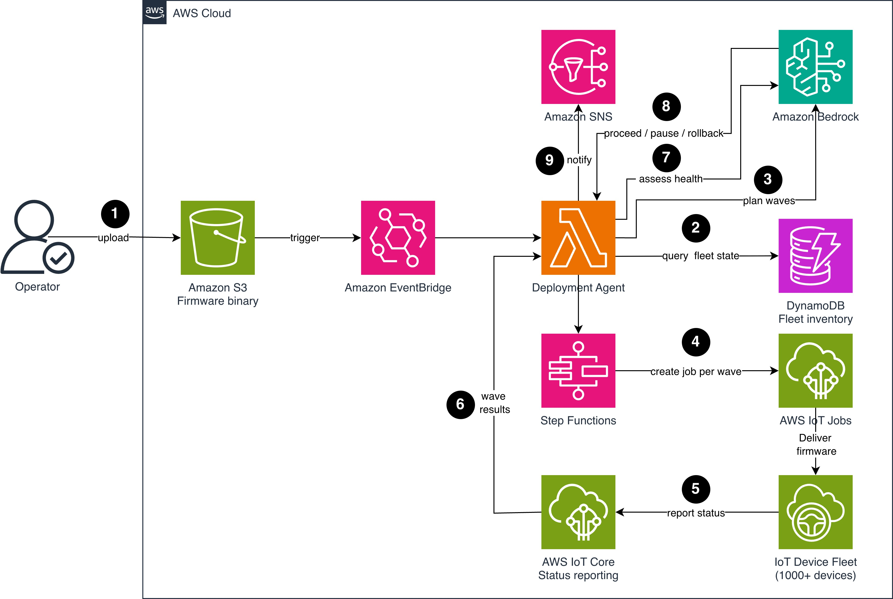
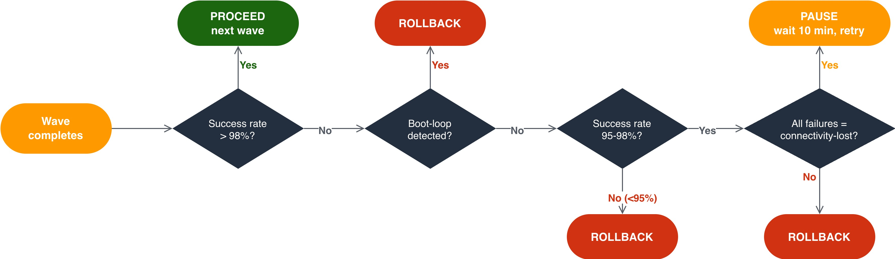

# Sample IoT firmware orchestration agent

Automate IoT firmware update orchestration with an AI agent on AWS.

## Overview

Automating Internet of Things (IoT) firmware update orchestration with an AI agent helps fleet operators deploy updates confidently at scale. Firmware updates require careful sequencing: the right devices first, at the right time, with continuous health monitoring and immediate rollback when needed. Today, operations teams manually plan deployment waves, monitor success rates, and make rollback decisions. As fleet size grows, the manual approach becomes a bottleneck.

This project shows you how to build an AI agent that autonomously orchestrates firmware deployments across your IoT fleet: selecting deployment waves based on device risk profiles, scheduling around production windows, monitoring rollout health in real time, and triggering automatic rollback when failure rates exceed thresholds.

Built with the [Strands Agents SDK](https://github.com/strands-agents/sdk-python) and Amazon Bedrock Claude Haiku 4.5, orchestrated by AWS Step Functions.

## The challenge: firmware deployments at fleet scale

Firmware updates to IoT fleets involve decisions that grow more complex as your fleet scales:

- **Wave planning**: Deciding which devices go first requires context. Best practice is to start with low-risk devices (development, non-production), then canary groups (small production subset), then full rollout. What counts as "low-risk" depends on device type, location, production schedule, and criticality.
- **Timing**: Updates that restart devices shouldn't happen during peak production. Each facility has different schedules, time zones, and maintenance windows.
- **Health monitoring**: After each wave, you need to verify devices come back online, report correct firmware version, and continue operating normally. A 2% failure rate in a canary group of 50 is one device. A 2% failure rate fleet-wide is 100 bricked devices.
- **Rollback decisions**: The threshold for stopping and rolling back depends on the failure mode: a connectivity-lost failure might be transient (wait), but a boot-loop failure is permanent (rollback immediately). An AI agent adds failure-type reasoning on top of the percentage-based cancellation that AWS IoT Jobs provides natively.

An AI agent makes these decisions dynamically based on real-time fleet state rather than static rules.

## Solution overview

The solution uses an AI agent as the decision-maker and AWS IoT Jobs for the actual firmware delivery. The agent plans deployment waves, monitors health after each wave, and decides whether to proceed, pause, or roll back. AWS Step Functions orchestrates the end-to-end workflow, and Amazon DynamoDB stores the fleet inventory and deployment history.

## Architecture

The following diagram shows the AI-driven firmware update orchestration architecture.



### Deployment planning

1. An operator uploads a new firmware binary to Amazon Simple Storage Service (Amazon S3) and triggers the deployment agent via Amazon EventBridge with target criteria (device type, minimum version, target version).
2. The deployment agent queries Amazon DynamoDB for the fleet inventory. For each device, it retrieves type, location, firmware version, criticality, last update result, and production schedule.
3. The agent uses Amazon Bedrock to plan deployment waves based on the fleet profile. The resulting plan includes a canary wave (5% of low-risk devices), an early adopter wave (20% mixed), and full rollout waves (remaining 75% in batches of 500).

### Wave execution

4. AWS Step Functions executes the deployment plan. For each wave, it creates an AWS IoT Job targeting the selected devices with the firmware from Amazon S3.
5. AWS IoT Jobs delivers the firmware to each device, managing the download, verification, and installation lifecycle. Devices report status back to AWS IoT Core as one of: queued, in-progress, succeeded, failed, rejected, or timed-out.
6. Step Functions waits for the wave to complete (devices report final status) or times out after a configurable window (default: 30 minutes per wave).

### Health assessment

7. After each wave completes, the deployment agent queries AWS IoT Jobs execution statuses for each device in the wave. It classifies failures into categories (connectivity-lost, boot-loop, version-mismatch, timeout) by inspecting the `detailsMap` field of failed executions for keyword indicators (for example, "restart" maps to boot-loop, "disconnect" maps to connectivity-lost).
8. The agent uses Amazon Bedrock to reason over the health data, including per-device failure details and hardware revision correlation, then decides: proceed to next wave, pause for investigation, or rollback the current wave.

### Rollback

9. If the agent decides to roll back, it creates a new AWS IoT Job targeting failed devices with the previous firmware version. It pauses subsequent waves and notifies the operator via Amazon Simple Notification Service (Amazon SNS) with a detailed explanation of why it rolled back.

## Prerequisites

- An AWS account with AWS Cloud Development Kit (AWS CDK) bootstrapped
- Python 3.13 or later
- AWS credentials configured
- Amazon Bedrock access with IAM permissions to invoke Anthropic Claude Haiku 4.5 (or your preferred foundation model)
- An IoT fleet registered in AWS IoT Core (or use the included simulator)

## Step-by-step deployment

Clone the repository and install dependencies:

```bash
git clone https://github.com/aws-samples/sample-iot-firmware-orchestration-agent.git
cd sample-iot-firmware-orchestration-agent

python3.13 -m venv .venv
source .venv/bin/activate
pip install -r requirements-dev.txt
```

Build the Lambda deployment package:

```bash
python scripts/build_lambda.py
```

### To deploy the infrastructure

The AWS CDK stack deploys the core orchestration components: AWS Step Functions state machine, deployment agent Lambda, and Amazon DynamoDB tables (fleet inventory and deployment history). It also provisions the supporting infrastructure: Amazon S3 bucket for firmware binaries, Amazon SNS topic for notifications, and Amazon EventBridge trigger.

```bash
cdk deploy FirmwareAgentStack
```

Verify the stack deployed successfully by checking the AWS CloudFormation console for the FirmwareAgentStack in CREATE_COMPLETE status.

## Deployment agent configuration

The deployment agent uses the Strands Agents SDK (`pip install strands-agents`), an open-source Python framework for building AI agents that integrates with Amazon Bedrock. Amazon Bedrock provides access to foundation models from multiple providers. This solution uses Anthropic Claude Haiku 4.5 for its fast inference speed and cost efficiency for agentic workloads. The agent invokes the model through Amazon Bedrock with the fleet inventory as context, allowing it to reason about device risk profiles and generate an optimal wave plan.

The agent exposes five tools to Bedrock:

| Tool | Purpose |
|------|---------|
| `get_fleet_inventory` | Query DynamoDB for devices eligible for update (by type, version) |
| `get_device_risk_profile` | Retrieve criticality, production schedule, and update history per device |
| `get_wave_health` | Get success/failure/timeout counts from a running AWS IoT Job |
| `create_deployment_wave` | Create an AWS IoT Job targeting a specific set of devices |
| `rollback_wave` | Cancel the current job and redeploy previous firmware to failed devices |

The agent's system prompt encodes the wave planning rules (canary 5% -> early adopter 20% -> full rollout) and health assessment thresholds (proceed above 98%, pause at 95-98%, rollback below 95% or on boot-loop detection). The full agent configuration and tool implementations are in the sample code repository.

## To test with simulated fleet

The repository includes a fleet simulator that registers virtual devices and simulates update outcomes:

```bash
# Register 100 simulated devices with varied risk profiles
python scripts/setup_fleet.py --devices 100

# Trigger a deployment (success scenario - 99% success rate)
python scripts/trigger_deployment.py --scenario successful_rollout

# Trigger a deployment (rollback scenario - firmware causes boot loops on 8% of devices)
python scripts/trigger_deployment.py --scenario canary_failure

# Trigger a deployment (partial failure - connectivity issues in one facility)
python scripts/trigger_deployment.py --scenario partial_connectivity_loss
```

### Expected behavior for canary_failure scenario

1. Agent plans 3 waves: canary (5 devices), early adopter (20 devices), full (75 devices)
2. Wave 1 (canary) executes: 4 succeed, 1 fails with boot-loop
3. Agent assesses: 1/5 = 20% failure rate, AND boot-loop detected
4. Agent decision: ROLLBACK - "Boot-loop failure detected in canary wave. 20% failure rate exceeds 5% threshold. Rolling back affected device and halting deployment. Firmware may have a compatibility issue with device hardware revision."
5. Agent rolls back the failed device, cancels remaining waves, sends Amazon SNS notification to operator

## Decision logic

The following diagram shows the agent's decision logic after each wave completes:



The agent encodes this logic in its system prompt but can reason beyond it for novel situations (for example, "all failures are from the same hardware revision" leads to pause and investigate rather than blanket rollback).

## How this differs from AWS IoT Jobs built-in cancellation configuration

AWS IoT Jobs provides a native cancellation configuration that cancels a job when a failure percentage threshold is exceeded. The AI agent extends this foundation with contextual reasoning:

| Capability | AWS IoT Jobs cancellation configuration | AI orchestration agent |
|-----------|---------------------------|------------------------|
| Trigger condition | Static percentage threshold (for example, >10% failed) | Reasons over failure TYPES (boot-loop, connectivity-lost, timeout) |
| Context awareness | Same threshold for all devices in a job | Considers device criticality, production schedule, historical success rate |
| Wave planning | Rate-based rollout with configurable rate limits | Plans canary -> early adopter -> full rollout based on risk profiles |
| Novel situations | Percentage-based pass/fail evaluation | Reasons over patterns ("all failures are same HW revision -> investigate compatibility") |
| Action options | Cancel only | Proceed, pause and investigate, rollback specific devices, retry transient failures |
| Scheduling | Time-window scheduling only | Avoids production peaks, coordinates across facilities and time zones |

AWS IoT Jobs handles firmware delivery as the execution layer. On top of this, the agent adds a decision layer, proceeding, pausing, or rolling back based on semantic reasoning rather than static counts. They are complementary: the agent creates and manages AWS IoT Jobs rather than replacing them.

## Security considerations

- **Firmware signing**: Sign firmware binaries with AWS IoT code signing before uploading to S3. Devices verify the signature before applying the update, preventing tampered binaries from being installed.
- **Encryption**: Enable SSE-KMS encryption on the Amazon S3 bucket storing firmware binaries. Enforce HTTPS-only access via bucket policy. AWS IoT Jobs delivers firmware URLs over Transport Layer Security (TLS).
- **AWS Identity and Access Management (IAM) least privilege**: The deployment agent Lambda role needs only iot:CreateJob, iot:DescribeJob, iot:CancelJob, dynamodb:Query, dynamodb:GetItem, and bedrock:InvokeModel. It does not need iot:DeleteThing, iot:UpdateCertificate, or administrative permissions.
- **Device authentication**: Devices authenticate to AWS IoT Core using X.509 certificates provisioned during manufacturing. Authenticated devices can receive job documents and download firmware from the presigned S3 URL.

## Clean up

To avoid ongoing charges, delete the deployed resources:

```bash
cdk destroy FirmwareAgentStack

# Remove simulated devices
python scripts/cleanup_fleet.py
```

## Run tests

```bash
# Unit tests (mocked AWS services via moto)
pytest tests/unit/ -m unit

# Property-based tests (Hypothesis, 100+ examples per property)
pytest tests/unit/test_wave_planning.py -m property

# Integration tests (mocked Lambda responses, state transitions)
pytest tests/integration/ -m integration

# E2E tests (requires deployed stack)
pytest tests/e2e/ -m e2e

# All local tests
pytest tests/unit/ tests/integration/
```

## Project structure

```
sample-iot-firmware-orchestration-agent/
├── app.py                              # CDK app entry point
├── cdk.json                            # CDK context and configuration
├── pyproject.toml                      # Project metadata, ruff config
├── requirements.txt                    # Runtime dependencies
├── requirements-dev.txt                # Dev/test dependencies
├── stacks/
│   └── firmware_agent_stack.py         # CDK stack definition
├── lambda/
│   ├── deployment_agent/
│   │   ├── handler.py                  # Lambda entry point with action routing
│   │   ├── agent.py                    # Strands agent configuration
│   │   ├── wave_planner.py             # Wave planning logic
│   │   ├── tools/                      # Agent tool implementations
│   │   └── models/                     # Pydantic data models
│   ├── event_parser/
│   │   └── handler.py                  # EventBridge S3 event parser
│   └── shared/
│       ├── constants.py                # Configuration and thresholds
│       └── job_id.py                   # Shared job ID construction helper
├── step_functions/
│   └── deployment_workflow.asl.json    # Step Functions state machine
├── scripts/
│   ├── setup_fleet.py                  # Register simulated devices
│   ├── trigger_deployment.py           # Trigger deployment scenarios
│   ├── cleanup_fleet.py               # Remove simulated devices
│   └── build_lambda.py                # Build Lambda deployment package
├── tests/
│   ├── unit/                           # Tool function tests + property tests
│   ├── integration/                    # Step Functions flow + decision tests
│   └── e2e/                            # Full deployed stack tests
├── docs/
│   └── image/
└── LICENSE                             # MIT-0
```

## Limitations and production considerations

This sample uses explicit device ARN enumeration (SNAPSHOT targeting) with a ceiling of 500 devices per wave due to the AWS IoT Jobs target list size limit. Production deployments should use [Dynamic Thing Groups](https://docs.aws.amazon.com/iot/latest/developerguide/dynamic-thing-groups.html) for targeting larger fleets without enumerating individual device ARNs.

Additional considerations for production use:

- **Firmware filename convention**: The EventBridge auto-trigger requires firmware binaries to follow the naming convention `firmware/{device_type}-v{version}.bin` (for example, `firmware/sensor-v1.2.3.bin`). Custom naming requires updating the event parser Lambda.
- **Failure classification**: Health assessment classifies failures by inspecting the `detailsMap` keyword matching in IoT Job execution status reports. The accuracy of classification depends on devices reporting meaningful status details.
- **Deployment history**: Every agent decision (PROCEED, PAUSE, ROLLBACK) is recorded in the DeploymentHistory DynamoDB table, enabling post-incident review.
- **Device outcome tracking**: Per-device update results are written back to FleetInventory, enabling canary wave ordering by prior update success in subsequent deployments.

For related patterns at larger scale, see:
- [Design IoT Jobs for rapid large-scale device updates](https://aws.amazon.com/blogs/iot/design-iot-jobs-for-rapid-large-scale-device-updates-with-advanced-device-group-target-patterns/)
- [Using dynamic thing groups to continuously update software](https://aws.amazon.com/blogs/iot/using-dynamic-thing-groups-to-continuously-update-software-on-devices/)

## References

- [AWS IoT Jobs](https://docs.aws.amazon.com/iot/latest/developerguide/iot-jobs.html)
- [AWS IoT Core](https://docs.aws.amazon.com/iot/latest/developerguide/)
- [Amazon Bedrock](https://docs.aws.amazon.com/bedrock/latest/userguide/)
- [AWS Step Functions](https://docs.aws.amazon.com/step-functions/latest/dg/)
- [AWS IoT Jobs rollout configuration](https://docs.aws.amazon.com/iot/latest/developerguide/job-rollout-abort.html)
- [Strands Agents SDK](https://github.com/strands-agents/sdk-python)
- [AWS Well-Architected IoT Lens](https://docs.aws.amazon.com/wellarchitected/latest/iot-lens/welcome.html)

## License

This project is licensed under the MIT-0 License. See the [LICENSE](LICENSE) file.
